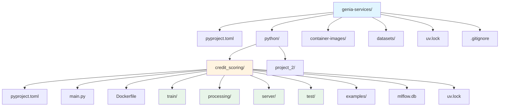

# Genia Services

Workspace de servicios de machine learning y análisis de datos, diseñado para albergar múltiples proyectos de ML con gestión unificada de dependencias y versionado de datos.

## 📋 Descripción

Genia Services es un workspace modular que proporciona una estructura organizada para desarrollar y desplegar servicios de machine learning. El proyecto utiliza un enfoque de workspace con múltiples subproyectos, permitiendo gestionar diferentes servicios de ML de forma independiente pero coordinada.

### Características principales

- **Workspace multi-proyecto**: Gestión centralizada de múltiples servicios de ML
- **Versionado de datos**: Integración con DVC (Data Version Control) para tracking de datasets
- **Experimentación con MLflow**: Seguimiento de experimentos y modelos
- **Containerización**: Soporte para Docker para despliegue consistente
- **Gestión de dependencias**: Uso de `uv` para gestión rápida y eficiente de paquetes Python

## 🏗️ Estructura del Proyecto



## 📁 Estructura de Directorios

```
genia-services/
├── pyproject.toml          # Configuración del workspace principal
├── uv.lock                  # Lock file de dependencias del workspace
├── README.md                # Este archivo
├── .gitignore              # Archivos ignorados por Git
│
├── python/                 # Proyectos Python del workspace
│   ├── credit_scoring/     # Servicio de credit scoring
│   │   ├── pyproject.toml  # Dependencias del proyecto (MLflow, PyTorch)
│   │   ├── main.py         # Punto de entrada principal
│   │   ├── Dockerfile      # Configuración de contenedor Docker
│   │   ├── uv.lock         # Lock file de dependencias
│   │   ├── mlflow.db       # Base de datos local de MLflow
│   │   ├── train/          # Módulos de entrenamiento de modelos
│   │   ├── processing/     # Procesamiento y transformación de datos
│   │   ├── server/         # Servidor API/backend
│   │   ├── test/           # Tests unitarios e integración
│   │   └── examples/       # Ejemplos de uso y notebooks
│   │
│   └── project_2/          # Segundo proyecto (en desarrollo)
│
├── container-images/       # Imágenes Docker y configuraciones
├── datasets/               # Datasets versionados con DVC
└── .dvc/                   # Configuración de DVC (ignorado en Git)
```

## 🚀 Requisitos

- **Python**: >= 3.13 (workspace principal), >= 3.11 (credit_scoring)
- **uv**: Gestor de dependencias Python (instalación: `curl -LsSf https://astral.sh/uv/install.sh | sh`)
- **Docker**: Para containerización (opcional)
- **Git**: Para control de versiones

## 📦 Instalación

### 1. Clonar el repositorio

```bash
git clone <repository-url>
cd genia-services
```

### 2. Instalar dependencias del workspace

```bash
# Instalar dependencias del workspace principal (DVC)
uv pip install -r pyproject.toml
```

### 3. Instalar dependencias del proyecto credit_scoring

```bash
cd python/credit_scoring
uv pip install -r pyproject.toml
```

### 4. Configurar DVC (opcional)

Si necesitas trabajar con datasets versionados:

```bash
# Desde la raíz del proyecto
dvc init
```

## 🎯 Uso

### Ejecutar el proyecto credit_scoring

```bash
cd python/credit_scoring
python main.py
```

### Trabajar con MLflow

El proyecto `credit_scoring` está configurado para usar MLflow. Para iniciar el servidor de MLflow:

```bash
cd python/credit_scoring
mlflow ui
```

Esto iniciará la interfaz web de MLflow en `http://localhost:5000`.

### Construir imagen Docker

```bash
cd python/credit_scoring
docker build -t credit-scoring:latest .
```

## 🔧 Tecnologías y Dependencias

### Workspace Principal
- **DVC** (>=3.66.1): Versionado de datos y pipelines de ML

### Proyecto Credit Scoring
- **MLflow** (>=3.8.1): Tracking de experimentos y gestión de modelos
- **PyTorch** (>=2.9.1): Framework de deep learning
- **Torchvision** (>=0.24.1): Utilidades de visión por computadora

## 🧪 Testing

Los tests se encuentran en el directorio `test/` de cada proyecto. Para ejecutar tests:

```bash
cd python/credit_scoring
# Ejecutar tests (ajustar según el framework de testing utilizado)
pytest test/
```

## 📝 Desarrollo

### Agregar un nuevo proyecto al workspace

1. Crear un nuevo directorio en `python/`
2. Crear un `pyproject.toml` con la configuración del proyecto
3. Agregar el proyecto a `[tool.uv.workspace]` en el `pyproject.toml` raíz:

```toml
[tool.uv.workspace]
members = [
    "python/credit_scoring",
    "python/nuevo_proyecto",  # Agregar aquí
]
```

### Gestión de dependencias

El proyecto utiliza `uv` para gestión de dependencias. Para actualizar dependencias:

```bash
# Actualizar lock file
uv lock

# Instalar dependencias actualizadas
uv pip install -r pyproject.toml
```

## 📊 Versionado de Datos con DVC

El proyecto utiliza DVC para versionar datasets grandes. Los datasets se almacenan en `datasets/` y se versionan con Git + DVC.

```bash
# Agregar un dataset
dvc add datasets/mi_dataset.csv

# Descargar datasets versionados
dvc pull
```

## 🐳 Docker

Cada proyecto puede tener su propio `Dockerfile` para containerización. Ver `python/credit_scoring/Dockerfile` como ejemplo.

## 📄 Licencia

[Especificar licencia aquí]

## 👥 Contribución

[Instrucciones de contribución aquí]

## 📧 Contacto

[Información de contacto aquí]

---

**Nota**: Este es un proyecto en desarrollo activo. La estructura puede evolucionar según las necesidades del proyecto.
